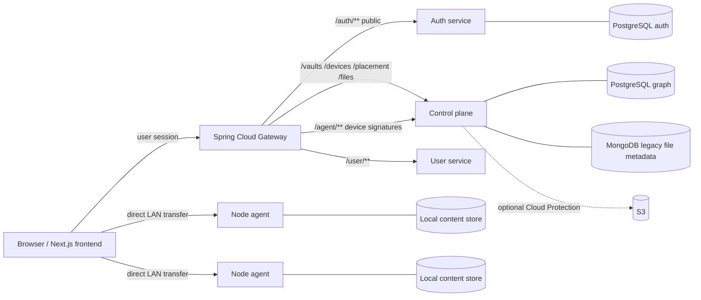

# Benzene

> One drive. Every computer. All your storage.

Benzene is a distributed personal storage system. A user installs a node agent
on computers they already own; those devices contribute capacity to a Vault and
the control plane places whole-file copies across them. Cloud storage is an
optional protection tier, not the definition of a file and not the primary
upload path.

The repository contains a working local/LAN development slice. Automatic
whole-file LAN repair fills recorded replica shortfalls via direct healthy-peer
transfer. Outage classification runs opportunistically while active repair and
user-facing paths run; presumed-lost inventory reconciliation is initiated by
returning agents;
encryption, remote access, chunking, garbage collection and several client
surfaces remain unfinished.

## How it fits together



The control plane answers who, what and where. It stores Vault, Device,
allocation, policy and replica metadata; it does not relay file bytes. Node
agents own the bytes and expose short-lived, scoped transfer targets on the
local network. The gateway verifies user sessions and injects identity headers;
the `/agent/**` path deliberately remains available to devices during
enrollment and uses Ed25519 request signatures instead.

## Services and ports

| Component | Stack | Port | Current role |
| --- | --- | ---: | --- |
| `nebulavault-frontend` | Next.js 16.3.5, React/react-dom 19.3.0, TypeScript | 3000 | Web UI and browser-side hashing/transfers; routing guard in `src/proxy.ts` |
| `nebula-gateway` | Java 21, Spring Cloud Gateway | 8080 | Session verification and routing |
| `benzene-auth-service` | Node 20, Express 5, TypeScript, PostgreSQL | 4000 | Email/password auth and cookies |
| `benzene-control-plane` | Node 20, Express 5, TypeScript, PostgreSQL + MongoDB | 5000 | Vaults, devices, placement and file metadata |
| `benzene-node-agent` | Node 20, Express 5, TypeScript | 7070 | Device identity, heartbeat and LAN object store |
| `nebulavault-user-service` | Java 21, Spring Boot, PostgreSQL | 8082 | User profile bootstrap and quota fields |

The frontend requires Node **20.9 or newer**. The former Next.js middleware
request guard now lives in `src/proxy.ts`.

The frontend, auth service, gateway, control plane and user service have
production Dockerfiles and are published by the release workflow. The node
agent intentionally remains a host/LAN process; it is not containerized because
it contributes storage from the user's own computer.

The frontend Docker context excludes local `.env*` files while allowing the
committed `.env.example`; its runtime stage contains only `public`, Next
standalone, and `.next/static` artifacts. The frontend, auth-service, gateway,
control-plane and user-service production runtime images run as dedicated
non-root `benzene` users. The node agent remains a host/LAN process. The
Full `npm audit` reports 0 vulnerabilities for the frontend, node-agent and
auth-service; the frontend's production-only (`npm audit --omit=dev`) audit
also reports 0, and the control-plane's production-only audit reports 0. The
control-plane full audit still reports four moderate, dev-only `esbuild`
findings through `drizzle-kit`; the only offered forced fix is a breaking
downgrade, so these package-specific results must not be summarized as a
repository-wide zero.

## What works today

- Email/password signup, login, logout, refresh and email verification through
  the self-contained auth service.
- Signup verification links route through the Next server bridge to a public,
  token-free result page. The authenticated LAN smoke now signs up through
  Next, renders the pending prompt, captures the loopback SMTP message,
  resends through the same-origin bridge, proves the original link is
  invalidated, verifies the replacement link and checks the persisted state.
  CI run `34788300450` is green with exactly 60 integrated acceptance `ok`
  assertions, including the already-verified resend response.
- Browser password-recovery pages and same-origin request bridges now exist.
  The same acceptance covers reset requests, reset completion, one-shot token
  rejection, old-password rejection and new-password login.
- Vault creation and device enrollment with a pairing code and explicit user
  approval.
- Device heartbeats, online/offline presence and configurable contributed
  allocation.
- Opportunistic device outage classification: silence defaults to `offline`
  after 120 seconds and `extended_offline` after 24 hours. `suspected_lost` is
  disabled unless `DEVICE_SUSPECTED_LOST_AFTER_SECONDS` is explicitly set to a
  value later than the extended-offline threshold.
- Presumed-lost inventory reconciliation: a returning device remains
  quarantined after a signed heartbeat until it has sent a fresh usage
  heartbeat and a complete, locally hash-verified inventory. One authenticated
  request carries at most 8,000 whole-file objects; known hash/size matches are
  restored, omissions and size mismatches become missing, and unknown hashes
  are ignored. The report is authenticated but is not independent proof
  against a compromised device. Repair bindings and capacity accounting are
  updated under the same per-object and allocation locks used by repair.
- Whole-file placement with protection policies and replica health reporting.
- Availability is reported separately from protection: a protected file may be
  `Waiting for device` when all durable copies are offline, `Restoring
  protection` while a reachable copy exists and repair is active, `Available`
  when an online healthy copy can serve it, or `Unavailable` when no durable
  healthy copy remains. The file UI exposes those states directly.
- Automatic whole-file LAN repair that fills recorded replica shortfalls by
  copying from a healthy peer, verifying the hash and recording the new replica.
- Coordinated whole-file drain and safe final device removal: capacity is
  preflighted, draining replicas leave protection counts, repair may copy from
  the draining source, and a signed, retry-safe node handshake waits for
  protection to return before quiescing transfers, erasing only Benzene-managed
  entries, and removing the device from the Vault.
- Browser-to-device upload and download over a LAN, with SHA-256 content
  addressing and device-side integrity checks.
- Authenticated LAN web-route/topology acceptance through Next.js, the Java
  gateway, auth/control plane and two real node agents: enrollment and
  approval, heartbeats, a default Protected two-device upload, completion,
  listing, protection/read planning and byte-identical reads from both agents
  are verified in CI. The current harness also exercises signup and email
  verification through loopback SMTP. This is not a browser-runtime test;
  frontend helper execution, CORS/mixed-content/browser enforcement,
  remote/TLS transfer, encryption and garbage collection remain outside this
  60-assertion LAN acceptance; the user service has a separate acceptance below.
- The user-profile acceptance signs up through Next, captures SMTP delivery,
  verifies pre-bootstrap 404 behavior, bootstraps and reads the persisted
  profile through the gateway and Next bridge, checks default profile/quota
  fields, and verifies anonymous redirects/401 responses. It has exactly 12
  `ok` assertions and is green in CI run `34768007763` at commit `090c7eb`.
- Frontend transfer helpers have seven deterministic `node:test`/`tsx` tests for
  hashing and reservation, direct Protected uploads, completion gating,
  pending/shortfall errors, download fallback, unresponsive-holder
  timeout/fallback and safe DOM cleanup. A live browser check verifies the
  landing page renders without an overlay and can navigate to sign-in; it also
  caught and fixed CSS import ordering and a missing base selector.
- An atomic, allocation-bounded node object store with restart-safe usage
  accounting.
- Vault and Devices views plus the current file-management UI.
- A Terraform definition for an optional private S3 bucket and least-privilege
  access. It is validated configuration, not an applied cloud deployment.
- Cross-package protocol vectors that keep device request signing and transfer
  grant formats byte-identical between the control plane and node agent.

## Deliberate limits

- Outage classification is not a standalone scheduler: it runs opportunistically
  from active repair and user-facing paths. Offline and extended-offline
  devices' replicas remain durable healthy protection, but cannot serve
  downloads or repair while the device is not online. An explicitly enabled
  suspected-lost device is quarantined and excluded from protection counts; its
  replica metadata is preserved. A signed heartbeat alone does not restore that
  state. The returning agent must complete a fresh usage heartbeat followed by
  a complete locally hash-verified inventory report; reports are authenticated
  but are not independent proof against a compromised device. The MVP accepts
  one request of at most 8,000 whole-file objects, restores only known
  hash/size matches, marks omissions and mismatches missing, ignores unknown
  hashes, and safely reconciles repair bindings and capacity accounting.
- Protection and availability are distinct. A file can remain protected while
  waiting for an offline device; the UI labels files `Waiting for device`,
  `Restoring protection`, `Available`, or `Unavailable` according to whether a
  reachable healthy copy exists and whether repair is active.
- Rebalancing is not implemented; repair currently acts on recorded replica
  shortfalls and can use a draining source. Final drain detach and device-row
  removal are implemented only after protection is restored and the node
  completes its signed removal handshake.
- Objects are whole files; chunking, manifests and streaming browser hashing are
  future work. The browser currently hashes a complete file in memory.
- Encryption at rest and key recovery are not implemented. Stored objects are
  plaintext and the recovery design must be settled before real user data is
  entrusted to the system.
- Remote access, NAT traversal and relay are not implemented. Browser CORS now
  works for the HTTP LAN development path, but an HTTPS-hosted app still cannot
  directly PUT to an HTTP device; remote/HTTPS transfer support remains
  unfinished.
- Garbage collection (GC) for unreferenced stored objects is not implemented.
- Device removal deletes managed filesystem entries rather than securely
  overwriting media. The agent refuses unsafe roots and refuses nonempty
  legacy/unmarked store roots; use a new empty path or perform an explicit
  manual migration before enrolling such a store.
- A replication policy of one copy is possible but can lose data when that
  device fails. Whether that choice should remain available is unresolved.
- Desktop/mobile apps, filesystem mounts, sharing, search, billing and cloud
  protection policy are not built.
- The control plane still keeps legacy file metadata in MongoDB while its Vault,
  Device and placement graph is in PostgreSQL.
- Node-agent private keys are protected as `0600` files rather than native
  Keychain/DPAPI/Keystore storage.

### Device-first MVP and commercial blockers

The architecture's earliest commercially testable MVP includes desktop, mobile
and web clients, with optional cloud protection. This branch validates the
control plane, node agent and web/LAN device-first slice; it is not yet that
commercial MVP. Desktop/mobile clients and filesystem mounts, remote/HTTPS
access, encryption and key recovery, cloud-protection policy and billing,
rebalancing, chunking, garbage collection, sharing and search remain blockers.
Availability, single-copy policy and key recovery remain open product
questions; this status does not resolve them.

## Security model

| Boundary | Mechanism |
| --- | --- |
| User → gateway | HS256 JWT in an `httpOnly` `session` cookie |
| Device → control plane | Ed25519 signature over method, path, timestamp and body hash |
| Browser/peer → device | Short-lived Ed25519 transfer grant scoped to object, device and operation |

The gateway strips incoming `X-User-*` headers before setting identity from a
verified session. The control plane must not be exposed directly to the public
internet. `AUTH_SECRET` must be at least 32 characters and must be identical in
the auth service, gateway and frontend. The auth service issues 15-minute
access tokens and seven-day opaque refresh tokens.

Pending device names and platforms are not globally listed; a user must enter
the short-lived code shown on that device to approve or reject it.

Device signatures receive one-shot PostgreSQL replay claims for the exact
method, path, timestamp and body request; an otherwise valid replay inside the
timestamp window is rejected. Refresh-token rotation is atomically single-use
in PostgreSQL, so concurrent uses of one token cannot both succeed.

Email-verification token replacement and consumption are also atomic in
PostgreSQL: concurrent resends leave one current token, concurrent verification
allows one consume, and a verified credential has no outstanding verification
tokens. Password-reset consumption similarly claims one token in a transaction,
updates the password, and revokes every refresh token together.

Unauthenticated enrollment creation is database-throttled per gateway-observed
client IP, defaulting to 10 attempts per 60 seconds. The gateway strips any
caller-supplied `X-Benzene-Client-Ip` and rewrites it from its observed peer;
direct development access falls back to the socket peer. The gateway currently
uses that direct socket peer and has no trusted-forwarded-header configuration,
so clients behind another proxy or load balancer may share that upstream peer's
bucket; trusted proxy resolution must be implemented and configured before
relying on per-origin buckets. Expired pending enrollments are cleaned in
bounded batches, and approval or rejection locks only the exact normalized code
row so competing decisions serialize. Authenticated approve/reject attempts
share a database-backed per-owner pairing budget, defaulting to 10 attempts per
60 seconds; it is separate from device-creation peer buckets.

## Storage accounting and repair safety

Capacity uses the latest device heartbeat as a `usedBytes` baseline, then adds
active placement reservations and possession-confirmed replicas newer than the
allocation's usage watermark. The same calculation is used by placement,
repair, drain preflight and allocation changes under an allocation-row lock,
so exact-fit reservations cannot over-issue between heartbeats.

Upload planning transactionally revalidates existing healthy holders while
locking devices, allocations and replicas; if a concurrent drain invalidates
the snapshot, it retries once so a leaving device cannot satisfy protection.

Legacy and device-backed completion paths serialize promotion per file and always
promote the highest committed immutable version, so a late lower completion
cannot overwrite current metadata. A process crash between demotion and
promotion can temporarily leave no current version until completion is retried
after the lease expires; stored immutable versions remain intact.

Repair work is bound to one healthy source and a persisted one-shot assignment
id. A signed source-failure report must name that source and assignment before
the same Unix-second grant boundary; consuming it clears the binding and makes
replays or unrelated reports ineffective.

Possession confirmation and repair/source-failure transitions serialize on the
replica row, so stale device possession cannot resurrect a failed repair
reservation. Logout clears browser credentials even when upstream revocation is
unavailable; the protected client leaves the session UI and keeps that
revocation failure observable. File and folder removal asks for confirmation,
and folder removal explicitly warns that descendants are included.

Vault online-device counts and online capacity use the same last-heartbeat
liveness cutoff as device views. Raw capacity remains owned capacity, even when
a device is stale or offline.

Outage classification uses the same defaults: 120 seconds to become offline and
24 hours to become extended-offline. Suspected-loss classification is disabled
unless `DEVICE_SUSPECTED_LOST_AFTER_SECONDS` is explicitly configured and is
strictly later than the extended-offline threshold. Classification is
opportunistic, not driven by a standalone scheduler. Offline and
extended-offline replicas remain durable healthy protection, but cannot serve
downloads or repair while their device is not online. Suspected-lost devices
are quarantined and excluded from protection counts while their replica metadata
is retained. Signed heartbeats do not clear that quarantine; the returning agent
must complete the documented inventory reconciliation flow.

## Local development

### Prerequisites

- Node.js 20
- PostgreSQL 16 and MongoDB
- Java 21 for the gateway and user service
- A shell with Maven available, or the checked-in `mvnw` scripts

The committed Maven wrappers are executable; CI uses their checked-in mode and
does not repair permissions.

Create two local databases before starting:

```bash
createdb benzene
createdb benzene_auth
```

Initialize the schemas that are not created automatically at service startup:

```bash
psql -d benzene_auth -f benzene-auth-service/src/db/migrations/001_initial.sql
psql -d benzene -f nebulavault-user-service/src/main/resources/schema.sql
```

Generate one shared secret and one control-plane transfer signing key:

```bash
node -e "console.log(require('crypto').randomBytes(32).toString('hex'))"
node -e "console.log(require('crypto').generateKeyPairSync('ed25519').privateKey.export({type:'pkcs8',format:'der'}).toString('base64'))"
```

Copy the committed environment templates:

```bash
cp benzene-auth-service/.env.example benzene-auth-service/.env
cp benzene-control-plane/.env.example benzene-control-plane/.env
cp benzene-node-agent/.env.example benzene-node-agent/.env
cp nebulavault-frontend/.env.example nebulavault-frontend/.env.local
```

Put the first generated value in `AUTH_SECRET` in the auth service, gateway
environment and frontend. Put the second in the control plane as
`TRANSFER_SIGNING_KEY`. Set `DATABASE_URL` in the auth service and control
plane, and `DB_URL` for the user service, to URLs for the role and host your
PostgreSQL installation actually uses; the `.env.example` values are
illustrative localhost examples, not universal credentials. For a Homebrew
install using the current macOS user, the Node URLs commonly look like
`postgresql://$USER@localhost:5432/benzene` and
`postgresql://$USER@localhost:5432/benzene_auth`; adjust the user, password,
host or socket settings when yours differ.

Run each process in its own terminal:

```bash
cd benzene-auth-service && npm ci && npm run dev
cd benzene-control-plane && npm ci && npm run db:migrate && npm run dev
cd nebula-gateway && AUTH_SECRET=<same generated AUTH_SECRET> ./mvnw spring-boot:run
cd nebulavault-user-service && DB_URL="jdbc:postgresql://localhost:5432/benzene?user=$USER" ./mvnw spring-boot:run
cd benzene-node-agent && npm ci && npm run dev
cd nebulavault-frontend && npm ci && npm run dev
```

The production control-plane image includes the committed Drizzle SQL and a
compiled migrator. Run `npm run db:migrate:runtime` as an explicit one-off
release step before starting `node built/server.js`; migrations are not run
automatically during server startup.

The first node-agent run creates an Ed25519 identity and prints a pairing code.
Approve that code from the Devices UI. Set `BENZENE_ADVERTISED_URL` when the
machine has multiple network interfaces; the default is its first non-internal
IPv4 address. The default agent allocation is zero bytes, so choose a positive
`BENZENE_ALLOCATED_BYTES` for a contributing device.

The default control-plane storage driver is local and needs no AWS credentials.
The S3 driver and Terraform configuration remain available as an optional,
secondary tier, but no claim is made here that a cloud deployment has been
applied or that it replaces device placement.

## Upload path

```text
1. Browser hashes the whole file with SHA-256.
2. Browser → gateway → control plane: POST /files/uploads/device with the
   logical file metadata and hash.
3. Control plane creates pending metadata, reserves replica slots and signs
   device transfer grants in that response.
4. Browser → each reachable node agent: PUT bytes directly over the LAN.
5. Each device verifies the bytes and reports possession to the control plane
   with its own Ed25519 identity.
6. Browser → gateway → control plane: POST /files/uploads/device/complete.
7. The control plane commits the logical version only when a healthy replica is
   recorded; incomplete protection remains visible as degraded.
```

Neither Next.js, the gateway nor the control plane is intended to carry file
bytes in this path.

## Useful routes

| Surface | Examples | Auth |
| --- | --- | --- |
| Auth | `/auth/signup`, `/auth/login`, `/auth/logout`, `/auth/refresh`, `/auth/verify-email`, `/auth/resend-verification`, `/auth/forgot-password`, `/auth/reset-password` | Public; establishes or renews cookies |
| Vault/device graph | `/vaults/**`, `/devices/**` | Gateway session |
| Placement and protection | `/placement/policy`, `/placement/protection` | Gateway session |
| Device-backed files | `POST /files/uploads/device`, `POST /files/uploads/device/complete` | Gateway session |
| File compatibility surface | `/files/**`, `/folders/**`, `/drive-nodes/**` | Gateway session |
| Agent | `/agent/enrollments`, `/agent/heartbeat`, `/agent/possession`, `/agent/repair` | Enrollment or device signature |

## Testing and CI

Run package checks locally:

```bash
cd benzene-auth-service && npm ci && npm run test:run
cd benzene-control-plane && npm ci && npm run typecheck && npm test
cd benzene-node-agent && npm ci && npm run typecheck && npm test
cd nebula-gateway && ./mvnw -B -ntp test

# acceptance (after building the required services)
node scripts/smoke-auth-gateway.mjs
node scripts/smoke-user-profile.mjs
```

Control-plane tests use real PostgreSQL and create throwaway databases per test
file. The cross-package smoke test (`node scripts/smoke-agent.mjs`) exercises
enrollment, heartbeat, presumed-lost inventory recovery, upload, download,
authentication rejection and device removal against running services. It starts
the real control plane and node agent itself and talks directly to the control
plane; it requires a reachable PostgreSQL instance, built packages and
MongoMemoryServer, and is not a mocked unit test.

The control-plane, node-agent and auth-service test suites use Vitest **4.1.11**
to preserve Node 20 compatibility and resolve the prior Vitest advisory. The
frontend transfer-helper tests use Node's built-in `node:test` and `node:assert`
through `tsx`.

The authenticated LAN acceptance (`node scripts/smoke-auth-gateway.mjs`) starts
the real auth service, control plane, Java gateway, Next server and two node
agents. It exercises authenticated Next web routes and direct LAN device
transfers, including signup and email verification through loopback SMTP,
pairing approval, heartbeats, Protected upload, completion/list/protection/read
planning, and byte-identical reads from both agents. It also covers password
recovery requests and reset completion, one-shot token rejection, old-password
rejection and new-password login. It is an HTTP route/topology harness, not a
browser-runtime test: it does not execute frontend helpers or validate CORS,
mixed-content, or other browser enforcement. Remote/TLS transfer, encryption
and garbage collection are not covered by this 60-assertion LAN harness; the
user service has a separate 12-assertion acceptance.

The user-profile acceptance (`node scripts/smoke-user-profile.mjs`) starts the
real auth service, gateway, user service and Next frontend. It covers real
signup/session, SMTP delivery, pre-bootstrap 404, profile bootstrap and reads
through the gateway and Next bridge, persisted default profile/quota fields,
Next anonymous redirect and gateway anonymous 401. It has exactly 12 `ok`
assertions and was green in CI run `34768007763` at commit `090c7eb`.

Verified counts: control plane **342** tests, agent **115**, auth **78** when its
real-Postgres concurrency tests are enabled, gateway **18**, frontend transfer
helpers **7**, user-profile acceptance **12 `ok` assertions**, and **63 smoke
checks**. The integrated authenticated LAN acceptance has exactly **60 `ok`
assertions** and was green in CI run `34788300450`. Default Turbopack and
Webpack production builds pass.

CI run `34788722098` is fully green and verifies exactly **78/78 auth tests**,
including real-Postgres concurrency regressions for refresh-token rotation,
password-reset consumption, email-verification replacement, and legacy-token
consumption.

GitHub Actions runs changed-area checks for the frontend, auth service, gateway,
control plane, node agent, Terraform and the guide files. It runs the
cross-package smoke when control-plane, node-agent, smoke-script or workflow
paths change. Frontend lint errors are fatal. Where a package has a lockfile,
CI uses `npm ci` for reproducibility.

## Release coverage

The release workflow follows pushes to `master` and version tags (`v*`). It
builds and publishes the five deployable server images with Dockerfiles: the
frontend, auth service, gateway, control plane and user service. The node agent
is intentionally excluded because it runs on the user's host and LAN.

## Repository layout

```text
benzene-control-plane/       Vault, device, placement and file metadata APIs
benzene-node-agent/          Device identity, object store and LAN transfer
benzene-auth-service/        Email/password authentication
nebula-gateway/              Session verification and edge routing
nebulavault-frontend/        Next.js web application
nebulavault-user-service/    User profile bootstrap and quota fields
infrastructure/terraform/    Optional S3 Cloud Protection infrastructure
scripts/smoke-agent.mjs      Cross-package HTTP smoke test
scripts/smoke-auth-gateway.mjs
                              Authenticated LAN web-route/topology acceptance
scripts/smoke-user-profile.mjs
                              Authenticated user-profile bootstrap acceptance
```

## Roadmap

The next priorities follow the architecture: design encryption and key recovery
before real user data; then make remote/HTTPS access safe. Rebalancing, chunking,
garbage collection and richer clients follow those foundations.

## Contributing

Use short-lived branches and pull requests. Keep protocol vector copies in sync
when changing wire formats, preserve the device-first model, and do not call an
unverified cloud deployment or future feature "working" in documentation.
