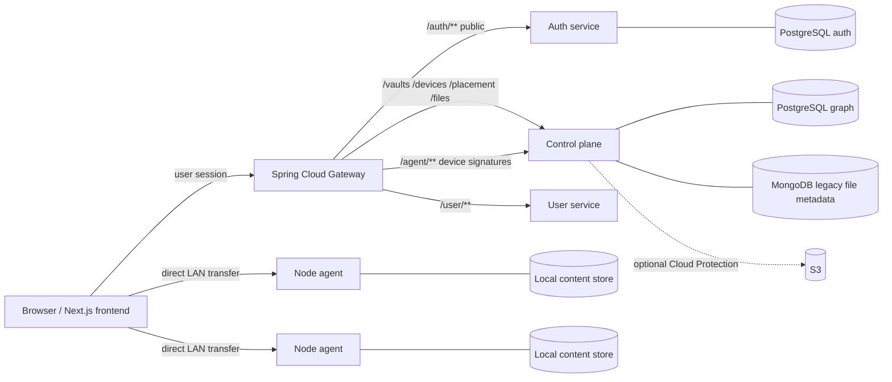

# Benzene

> One drive. Every computer. All your storage.

Benzene is a distributed personal storage system. A user installs a node agent
on computers they already own; those devices contribute capacity to a Vault and
the control plane places whole-file copies across them. Cloud storage is an
optional protection tier, not the definition of a file and not the primary
upload path.

The repository contains a working local/LAN development slice. Automatic
whole-file LAN repair fills recorded replica shortfalls via direct healthy-peer
transfer, but this is not yet a production-ready remote drive: outage/loss
classification, final drain detach, encryption, remote access, chunking,
garbage collection and several client surfaces remain unfinished.

## How it fits together



The control plane answers who, what and where. It stores Vault, Device,
allocation, policy and replica metadata; it does not relay file bytes. Node
agents own the bytes and expose short-lived, scoped transfer targets on the
local network. The gateway verifies user sessions and injects identity headers;
the `/agent/**` path deliberately remains available to devices during
enrollment and uses Ed25519 request signatures instead.

## Services and ports

| Component | Stack | Port | Current role |
| --- | --- | ---: | --- |
| `nebulavault-frontend` | Next.js 15, React 19, TypeScript | 3000 | Web UI and browser-side hashing/transfers |
| `nebula-gateway` | Java 21, Spring Cloud Gateway | 8080 | Session verification and routing |
| `benzene-auth-service` | Node 20, Express 5, TypeScript, PostgreSQL | 4000 | Email/password auth and cookies |
| `benzene-control-plane` | Node 20, Express 5, TypeScript, PostgreSQL + MongoDB | 5000 | Vaults, devices, placement and file metadata |
| `benzene-node-agent` | Node 20, Express 5, TypeScript | 7070 | Device identity, heartbeat and LAN object store |
| `nebulavault-user-service` | Java 21, Spring Boot, PostgreSQL | 8082 | User profile bootstrap and quota fields |

The frontend, auth service, gateway, control plane and user service have
production Dockerfiles and are published by the release workflow. The node
agent intentionally remains a host/LAN process; it is not containerized because
it contributes storage from the user's own computer.

## What works today

- Email/password signup, login, logout, refresh, email verification and
  password reset through the self-contained auth service.
- Vault creation and device enrollment with a pairing code and explicit user
  approval.
- Device heartbeats, online/offline presence and configurable contributed
  allocation.
- Whole-file placement with protection policies and replica health reporting.
- Automatic whole-file LAN repair that fills recorded replica shortfalls by
  copying from a healthy peer, verifying the hash and recording the new replica.
- Coordinated whole-file drain preparation: capacity is preflighted, draining
  replicas leave protection counts, repair may copy from the draining source,
  and the UI reports `Ready to disconnect` once healthy copies exist elsewhere.
- Browser-to-device upload and download over a LAN, with SHA-256 content
  addressing and device-side integrity checks.
- An atomic, allocation-bounded node object store with restart-safe usage
  accounting.
- Vault and Devices views plus the current file-management UI.
- A Terraform definition for an optional private S3 bucket and least-privilege
  access. It is validated configuration, not an applied cloud deployment.
- Cross-package protocol vectors that keep device request signing and transfer
  grant formats byte-identical between the control plane and node agent.

## Deliberate limits

- Drain preparation is implemented, but final detach/device-row removal,
  outage/loss classification and rebalancing are not; repair currently acts on
  recorded replica shortfalls and can use a draining source.
- Objects are whole files; chunking, manifests and streaming browser hashing are
  future work. The browser currently hashes a complete file in memory.
- Encryption at rest and key recovery are not implemented. Stored objects are
  plaintext and the recovery design must be settled before real user data is
  entrusted to the system.
- Remote access, NAT traversal and relay are not implemented. Browser CORS now
  works for the HTTP LAN development path, but an HTTPS-hosted app still cannot
  directly PUT to an HTTP device; remote/HTTPS transfer support remains
  unfinished.
- Garbage collection (GC) for unreferenced stored objects is not implemented.
- A replication policy of one copy is possible but can lose data when that
  device fails. Whether that choice should remain available is unresolved.
- Desktop/mobile apps, filesystem mounts, sharing, search, billing and cloud
  protection policy are not built.
- The control plane still keeps legacy file metadata in MongoDB while its Vault,
  Device and placement graph is in PostgreSQL.
- Node-agent private keys are protected as `0600` files rather than native
  Keychain/DPAPI/Keystore storage.

## Security model

| Boundary | Mechanism |
| --- | --- |
| User → gateway | HS256 JWT in an `httpOnly` `session` cookie |
| Device → control plane | Ed25519 signature over method, path, timestamp and body hash |
| Browser/peer → device | Short-lived Ed25519 transfer grant scoped to object, device and operation |

The gateway strips incoming `X-User-*` headers before setting identity from a
verified session. The control plane must not be exposed directly to the public
internet. `AUTH_SECRET` must be at least 32 characters and must be identical in
the auth service, gateway and frontend. The auth service issues 15-minute
access tokens and seven-day opaque refresh tokens.

## Storage accounting and repair safety

Capacity uses the latest device heartbeat as a `usedBytes` baseline, then adds
active placement reservations and possession-confirmed replicas newer than the
allocation's usage watermark. The same calculation is used by placement,
repair, drain preflight and allocation changes under an allocation-row lock,
so exact-fit reservations cannot over-issue between heartbeats.

Repair work is bound to one healthy source and a persisted one-shot assignment
id. A signed source-failure report must name that source and assignment before
the same Unix-second grant boundary; consuming it clears the binding and makes
replays or unrelated reports ineffective.

## Local development

### Prerequisites

- Node.js 20
- PostgreSQL 16 and MongoDB
- Java 21 for the gateway and user service
- A shell with Maven available, or the checked-in `mvnw` scripts

Create two local databases before starting:

```bash
createdb benzene
createdb benzene_auth
```

Generate one shared secret and one control-plane transfer signing key:

```bash
node -e "console.log(require('crypto').randomBytes(32).toString('hex'))"
node -e "console.log(require('crypto').generateKeyPairSync('ed25519').privateKey.export({type:'pkcs8',format:'der'}).toString('base64'))"
```

Copy the committed environment templates:

```bash
cp benzene-auth-service/.env.example benzene-auth-service/.env
cp benzene-control-plane/.env.example benzene-control-plane/.env
cp benzene-node-agent/.env.example benzene-node-agent/.env
cp nebulavault-frontend/.env.example nebulavault-frontend/.env.local
```

Put the first generated value in `AUTH_SECRET` in the auth service, gateway
environment and frontend. Put the second in the control plane as
`TRANSFER_SIGNING_KEY`. The control plane also needs `DATABASE_URL` and
`MONGOOSE_URI`; the templates contain working localhost examples.

Run each process in its own terminal:

```bash
cd benzene-auth-service && npm ci && npm run dev
cd benzene-control-plane && npm ci && npm run db:migrate && npm run dev
cd nebula-gateway && ./mvnw spring-boot:run
cd nebulavault-user-service && DB_URL=jdbc:postgresql://localhost:5432/benzene ./mvnw spring-boot:run
cd benzene-node-agent && npm ci && npm run dev
cd nebulavault-frontend && npm ci && npm run dev
```

The production control-plane image includes the committed Drizzle SQL and a
compiled migrator. Run `npm run db:migrate:runtime` as an explicit one-off
release step before starting `node built/server.js`; migrations are not run
automatically during server startup.

The first node-agent run creates an Ed25519 identity and prints a pairing code.
Approve that code from the Devices UI. Set `BENZENE_ADVERTISED_URL` when the
machine has multiple network interfaces; the default is its first non-internal
IPv4 address. The default agent allocation is zero bytes, so choose a positive
`BENZENE_ALLOCATED_BYTES` for a contributing device.

The default control-plane storage driver is local and needs no AWS credentials.
The S3 driver and Terraform configuration remain available as an optional,
secondary tier, but no claim is made here that a cloud deployment has been
applied or that it replaces device placement.

## Upload path

```text
1. Browser hashes the whole file with SHA-256.
2. Browser → gateway → control plane: POST /files/uploads/device with the
   logical file metadata and hash.
3. Control plane creates pending metadata, reserves replica slots and signs
   device transfer grants in that response.
4. Browser → each reachable node agent: PUT bytes directly over the LAN.
5. Each device verifies the bytes and reports possession to the control plane
   with its own Ed25519 identity.
6. Browser → gateway → control plane: POST /files/uploads/device/complete.
7. The control plane commits the logical version only when a healthy replica is
   recorded; incomplete protection remains visible as degraded.
```

Neither Next.js, the gateway nor the control plane is intended to carry file
bytes in this path.

## Useful routes

| Surface | Examples | Auth |
| --- | --- | --- |
| Auth | `/auth/signup`, `/auth/login`, `/auth/logout`, `/auth/refresh`, `/auth/verify-email`, `/auth/resend-verification`, `/auth/forgot-password`, `/auth/reset-password` | Public; establishes or renews cookies |
| Vault/device graph | `/vaults/**`, `/devices/**` | Gateway session |
| Placement and protection | `/placement/policy`, `/placement/protection` | Gateway session |
| Device-backed files | `POST /files/uploads/device`, `POST /files/uploads/device/complete` | Gateway session |
| File compatibility surface | `/files/**`, `/folders/**`, `/drive-nodes/**` | Gateway session |
| Agent | `/agent/enrollments`, `/agent/heartbeat`, `/agent/possession`, `/agent/repair` | Enrollment or device signature |

## Testing and CI

Run package checks locally:

```bash
cd benzene-auth-service && npm ci && npm run test:run
cd benzene-control-plane && npm ci && npm run typecheck && npm test
cd benzene-node-agent && npm ci && npm run typecheck && npm test
cd nebula-gateway && ./mvnw -B -ntp test
```

Control-plane tests use real PostgreSQL and create throwaway databases per test
file. The agent smoke test (`node scripts/smoke-agent.mjs`) exercises enrollment,
heartbeat, upload, download and rejected unauthorized requests against running
services. It starts the real control plane and node agent itself and talks
directly to the control plane; it requires a reachable PostgreSQL instance,
built packages and MongoMemoryServer, and is not a mocked unit test.

Verified counts: control plane **287** tests, agent **86**, auth **72**, gateway
**15**, and **34 smoke checks**.

GitHub Actions runs changed-area checks for the frontend, auth service, gateway,
control plane, node agent, Terraform and the guide files. Frontend lint errors
are fatal. Where a package has a lockfile, CI uses `npm ci` for reproducibility.

## Release coverage

The release workflow follows pushes to `master` and version tags (`v*`). It
builds and publishes the five deployable server images with Dockerfiles: the
frontend, auth service, gateway, control plane and user service. The node agent
is intentionally excluded because it runs on the user's host and LAN.

## Repository layout

```text
benzene-control-plane/       Vault, device, placement and file metadata APIs
benzene-node-agent/          Device identity, object store and LAN transfer
benzene-auth-service/        Email/password authentication
nebula-gateway/              Session verification and edge routing
nebulavault-frontend/        Next.js web application
nebulavault-user-service/    User profile bootstrap and quota fields
infrastructure/terraform/    Optional S3 Cloud Protection infrastructure
scripts/smoke-agent.mjs      Cross-package HTTP smoke test
```

## Roadmap

The next priorities follow the architecture: design encryption and key recovery
before real user data; then make remote/HTTPS access safe; then complete
outage/loss classification and the drain lifecycle, including final detach and
device-row removal after `Ready to disconnect`. Rebalancing, chunking, garbage
collection and richer clients follow those foundations.

## Contributing

Use short-lived branches and pull requests. Keep protocol vector copies in sync
when changing wire formats, preserve the device-first model, and do not call an
unverified cloud deployment or future feature "working" in documentation.
