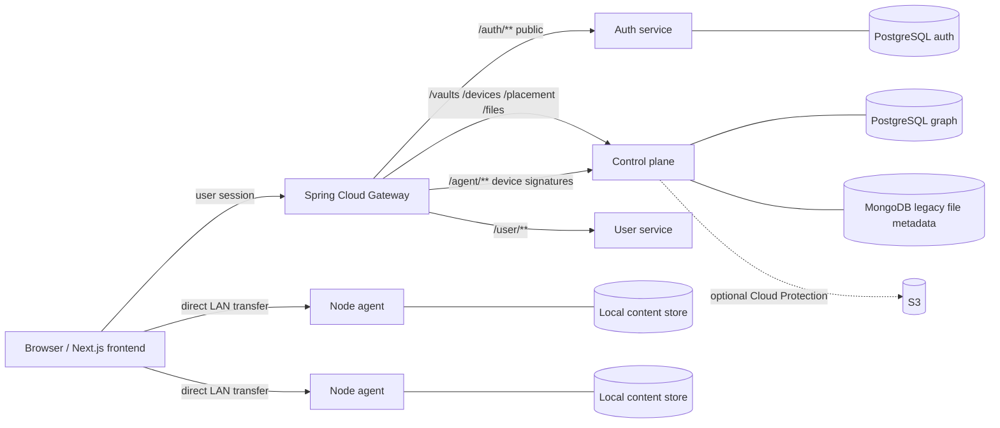

# Benzene

> One drive. Every computer. All your storage.

Benzene is a distributed personal storage system. A user installs a node agent
on computers they already own; those devices contribute capacity to a Vault and
the control plane places whole-file copies across them. Cloud storage is an
optional protection tier, not the definition of a file and not the primary
upload path.

The repository contains a working local/LAN development slice. Automatic
whole-file LAN repair fills recorded replica shortfalls via direct healthy-peer
transfer, reference-safe garbage collection retires purged objects, and
rate-limited rebalancing redistributes healthy copies after protection is
satisfied. A background outage sweep persists device transitions, while
returning presumed-lost agents reconcile a locally verified inventory.
Web, desktop and mobile encrypt new device-backed files, and the Electron
desktop client runs an independent node agent. Web and desktop now support
mobile-compatible v1 recovery-kit creation and signed WSS relay fallback, but
public relay deployment and the complete key lifecycle remain unverified.
Chunking and several client/release requirements also remain unfinished.

## How it fits together


```mermaid
flowchart LR
  B[Browser / Next.js frontend] -->|user session| G[Spring Cloud Gateway]
  G -->|/auth/** public| A[Auth service]
  G -->|/vaults /devices /placement /files| C[Control plane]
  G -->|/user/**| U[User service]
  G -->|/agent/** device signatures| C
  B -->|direct LAN transfer| N1[Node agent]
  B -->|direct LAN transfer| N2[Node agent]
  A --- PA[(PostgreSQL auth)]
  C --- PC[(PostgreSQL graph)]
  C --- MC[(MongoDB legacy file metadata)]
  N1 --- D1[(Local content store)]
  N2 --- D2[(Local content store)]
  C -. optional Cloud Protection .-> S3[(S3)]
```

The control plane answers who, what and where. It stores Vault, Device,
allocation, policy and replica metadata; it does not relay file bytes. Node
agents own the bytes and expose short-lived, scoped transfer targets. Web,
desktop and mobile encrypted downloads try direct targets first and can request
a one-use, control-plane-authorized WSS relay fallback; the separately
deployed relay handles opaque ciphertext. Clients validate ticket scope,
expiry, size, frames, hash and close state, then authenticate and decrypt
locally before export. Next.js proxies only the relay ticket request. The
gateway verifies user sessions and injects identity headers; the `/agent/**`
path deliberately remains available to devices during enrollment and uses
Ed25519 request signatures instead.

## Services and ports

| Component | Stack | Port | Current role |
| --- | --- | ---: | --- |
| `nebulavault-frontend` | Next.js 16.3.5, React/react-dom 19.3.0, TypeScript | 3000 | Web UI and browser-side hashing/transfers; routing guard in `src/proxy.ts` |
| `nebula-gateway` | Java 21, Spring Cloud Gateway | 8080 | Session verification and routing |
| `benzene-auth-service` | Node 20, Express 5, TypeScript, PostgreSQL | 4000 | Email/password auth and cookies |
| `benzene-control-plane` | Node 20, Express 5, TypeScript, PostgreSQL + MongoDB | 5000 | Vaults, devices, placement and file metadata |
| `benzene-node-agent` | Node 20, Express 5, TypeScript | 7070 | Device identity, heartbeat and LAN object store |
| `benzene-relay-service` | Node 20, WebSocket, TypeScript, PostgreSQL | 8090 | Opaque encrypted-read fallback; not deployed |
| `nebulavault-user-service` | Java 21, Spring Boot, PostgreSQL | 8082 | User profile bootstrap and quota fields |
| `benzene-mobile` | Expo SDK 57, React Native, TypeScript | — | Native mobile app with encrypted file transfers; unsigned JS exports only |
| `benzene-desktop` | Electron, TypeScript | — | Installable desktop wrapper for the web app and independent node agent; signed release unverified |

The frontend requires Node **20.9 or newer**. The former Next.js middleware
request guard now lives in `src/proxy.ts`.

The frontend, auth service, gateway, control plane and user service have
production Dockerfiles and are published by the release workflow. The node
agent intentionally remains a host/LAN process; it is not containerized because
it contributes storage from the user's own computer. The relay service has a
non-root runtime image, separate liveness and PostgreSQL-backed readiness, and
upgrade draining, but still lacks a verified production deployment.

The frontend Docker context excludes local `.env*` files while allowing the
committed `.env.example`; its runtime stage contains only `public`, Next
standalone, and `.next/static` artifacts. The frontend, auth-service, gateway,
control-plane and user-service production runtime images run as dedicated
non-root `benzene` users. The node agent remains a host/LAN process. Full
`npm audit` reports 0 vulnerabilities for the frontend, node-agent and
auth-service and mobile client. The frontend's production-only
(`npm audit --omit=dev`) audit also reports 0, and the control-plane's
production-only audit reports 0. The
control-plane full audit still reports four moderate, dev-only `esbuild`
findings through `drizzle-kit`; the only offered forced fix is a breaking
downgrade, so these package-specific results must not be summarized as a
repository-wide zero.

## What works today

- Email/password signup, login, logout, refresh and email verification through
  the self-contained auth service.
- Signup verification links route through the Next server bridge to a public,
  token-free result page. The authenticated LAN smoke now signs up through
  Next, renders the pending prompt, captures the loopback SMTP message,
  resends through the same-origin bridge, proves the original link is
  invalidated, verifies the replacement link and checks the persisted state.
  CI run `34788300450` is green with exactly 60 integrated acceptance `ok`
  assertions, including the already-verified resend response.
- Browser password-recovery pages and same-origin request bridges now exist.
  The same acceptance covers reset requests, reset completion, one-shot token
  rejection, old-password rejection and new-password login.
- Native mobile app: secure token storage and bearer sessions, signup/email
  verification/password recovery, nested folder browsing and creation,
  Vault/file/device screens, settings and an account-deletion request screen.
  Encrypted uploads retain the current folder path. It encrypts whole files with a device-only
  Vault key, uploads ciphertext to granted devices, and downloads direct-first
  with a bounded encrypted WSS relay fallback. Upload requires a
  passphrase-encrypted recovery kit. A local real-component acceptance now
  proves relay assignment, ticket pairing, opaque ciphertext streaming, mobile
  authentication/decryption and signed completion; public WSS deployment and
  remote-network acceptance remain unverified. Transfers buffer whole files
  and are limited to 25 MiB. Key rotation, trusted-device recovery and signed
  store builds remain unfinished.
- Web and desktop device-backed uploads encrypt new content using shared
  `encrypted-object-v1`; downloads authenticate ciphertext before decrypting.
  Both try direct transfers first, then can use the existing signed WSS relay
  ticket to receive opaque ciphertext, which is scope/expiry/size/frame/hash/
  close-validated before local decryption and export. Next.js proxies only the
  ticket request. Browser transfers are capped at 25 MiB. Plaintext-era objects
  remain readable. The shared web/desktop UI now offers a user-triggered copy-forward for
  eligible legacy device files: it downloads from a reachable holder, verifies
  the source SHA-256, encrypts locally, and commits a new immutable version
  while retaining the old one. This flow is unavailable in mobile, requires
  recovery-acknowledged key state and fits within the existing 25 MiB bound; it has not been verified
  in a live production deployment.
- Web and desktop can create and export mobile-compatible v1 recovery kits
  using secure randomness. Newly created keys cannot upload until the user
  confirms that the kit was saved; importing a kit is itself recovery proof.
  Browser keys and pending recovery state stay in tab memory. Desktop persists
  through Electron `safeStorage` only after confirmation or valid import,
  scoped to app origin and Vault. Restored keys remain acknowledged because
  only those two paths can reach secure storage. After a browser reload, the
  recovery kit must be imported again to establish proof before upload. Linux
  persistence is disabled when `basic_text` is the selected backend. Corrupt
  records are repaired only after a valid import, and a different valid key
  cannot replace the saved key.
- The installable Electron desktop client opens the configured web app and
  runs the node agent as an independent process, which continues after the
  window closes. A local macOS ARM64 installer was built unsigned. A manual
  protected signing/notarization workflow exists, but no signed/notarized
  release has been verified. An unsigned Windows NSIS build and silent install
  smoke passes in CI. A signed Windows clean-machine acceptance script is
  available but unrun; signed Windows and Linux installer acceptance remain
  unverified.
  Imported Vault keys persist through Electron `safeStorage` after explicit
  save confirmation, scoped to the configured app origin and Vault. Linux
  persistence is disabled when the selected backend is `basic_text`. Corrupt
  records are repaired only after a valid recovery-kit import, and a different
  valid key cannot replace an existing key. Browser keys remain in tab memory.
- Password-confirmed account-deletion requests revoke renewable sessions and
  enter a durable, leased cleanup phase runner. Missing or failed downstream
  handlers block and retry instead of reporting completion. The optional
  scheduler supports profile cleanup and, when both services are configured,
  delayed stored-object cleanup through reference-safe garbage collection and
  device-data cleanup. Device cleanup starts the existing safe drain/erase
  handshake and remains pending until every device returns its signed
  acknowledgement; offline devices keep deletion pending. Vault metadata is
  removed only after file versions, references, replicas, devices and live
  relay work are gone. Billing and backup/log phases remain blocked unless an
  operator supplies their exact current-inventory absence attestations. A
  private device-only receipt lets the signed-out mobile client verify final
  completion after its credential has been erased.
- Vault creation and device enrollment with a pairing code and explicit user
  approval.
- Device heartbeats, online/offline presence and configurable contributed
  allocation.
- Automatic device outage classification: silence defaults to `offline`
  after 120 seconds and `extended_offline` after 24 hours. `suspected_lost` is
  disabled unless `DEVICE_SUSPECTED_LOST_AFTER_SECONDS` is explicitly set to a
  value later than the extended-offline threshold. A non-overlapping background
  sweep runs every 60 seconds by default, and active paths also classify on
  demand.
- Presumed-lost inventory reconciliation: a returning device remains
  quarantined after a signed heartbeat until it has sent a fresh usage
  heartbeat and a complete, locally hash-verified inventory. One authenticated
  request carries at most 8,000 whole-file objects; known hash/size matches are
  restored, omissions and size mismatches become missing, and unknown hashes
  are ignored. The report is authenticated but is not independent proof
  against a compromised device. Repair bindings and capacity accounting are
  updated under the same per-object and allocation locks used by repair.
- Whole-file placement with protection policies and replica health reporting.
- Availability is reported separately from protection: a protected file may be
  `Waiting for device` when all durable copies are offline, `Restoring
  protection` while a reachable copy exists and repair is active, `Available`
  when an online healthy copy can serve it, or `Unavailable` when no durable
  healthy copy remains. The file UI exposes those states directly.
- Automatic whole-file LAN repair that fills recorded replica shortfalls by
  copying from a healthy peer, verifying the hash and recording the new replica.
- Reference-safe whole-file garbage collection after explicit purge, with
  durable exact assignments, idempotent device deletion, legacy-reference
  backfill and cancellation when a reference returns.
- Automatic whole-file rebalancing after protection is healthy. A target copies
  directly from a more utilized source, verifies and records the bytes, and only
  then gives the old source a durable deletion assignment. One new move per
  Vault is admitted every five minutes by default.
- Optional TLS termination for the existing grant-protected node transfer API.
  HTTP remains the LAN-development default; operators must supply a trusted
  certificate and matching private key.
- Offline metadata backup/restore tooling creates paired, checksummed
  PostgreSQL and MongoDB archives with owner-only permissions and requires
  explicit maintenance-window and destructive-target confirmation. The
  safeguards are tested, and CI performs an isolated live-database backup,
  destructive mutation, paired restore and projection comparison. A
  production-sized disaster-recovery exercise remains outstanding.
- Coordinated whole-file drain and safe final device removal: capacity is
  preflighted, draining replicas leave protection counts, repair may copy from
  the draining source, and a signed, retry-safe node handshake waits for
  protection to return before quiescing transfers, erasing only Benzene-managed
  entries, and removing the device from the Vault.
- Browser-to-device upload and download over a LAN, with SHA-256 content
  addressing and device-side integrity checks.
- Mongo-backed upload versioning is concurrency-safe for both legacy presign
  and device-backed reservations: concurrent requests receive distinct
  immutable version numbers, and reverse-order completion leaves the highest
  committed version current with matching node metadata.
- Directory listings batch protection for all distinct current file hashes:
  one outage classification, policy load and replica/device query replaces
  per-file N+1 work. Zero-replica hashes still receive summaries, while empty
  input returns without creating vault or policy state.
- Authenticated LAN web-route/topology acceptance through Next.js, the Java
  gateway, auth/control plane and two real node agents: enrollment and
  approval, heartbeats, a default Protected two-device upload, completion,
  listing, protection/read planning and byte-identical reads from both agents
  are verified in CI. The current harness also exercises signup and email
  verification through loopback SMTP. This is not a browser-runtime test;
  frontend helper execution, CORS/mixed-content/browser enforcement,
  remote/TLS transfer, encryption and garbage collection remain outside this
  64-assertion LAN acceptance; the user service has a separate acceptance below.
- The user-profile acceptance signs up through Next, captures SMTP delivery,
  verifies pre-bootstrap 404 behavior, bootstraps and reads the persisted
  profile through the gateway and Next bridge, checks default profile/quota
  fields, verifies anonymous redirects/401 responses, and exercises the durable
  account-deletion/profile-cleanup journey. It has exactly 17 `ok` assertions.
- Frontend transfer helpers have eight deterministic `node:test`/`tsx` tests
  (five upload and three download) for hashing and reservation, direct
  Protected uploads, completion gating, pending/shortfall errors, download
  fallback, unresponsive-holder timeout/fallback and safe DOM cleanup. Reduced
  protection messaging is based on authoritative completion state rather than
  the reservation plan. A live browser check verifies the landing page renders
  without an overlay and can navigate to sign-in; it also caught and fixed CSS
  import ordering and a missing base selector.
- An atomic, allocation-bounded node object store with restart-safe usage
  accounting.
- Vault and Devices views plus the current file-management UI.
- A Terraform definition for an optional private S3 bucket and least-privilege
  access. It is validated configuration, not an applied cloud deployment.
- Cross-package protocol vectors that keep device request signing and transfer
  grant formats byte-identical between the control plane and node agent.

## Deliberate limits

- Outage classification is persisted by a background sweep and refreshed by
  active repair and user-facing paths. Offline and extended-offline
  devices' replicas remain durable healthy protection, but cannot serve
  downloads or repair while the device is not online. An explicitly enabled
  suspected-lost device is quarantined and excluded from protection counts; its
  replica metadata is preserved. A signed heartbeat alone does not restore that
  state. The returning agent must complete a fresh usage heartbeat followed by
  a complete locally hash-verified inventory report; reports are authenticated
  but are not independent proof against a compromised device. The MVP accepts
  one request of at most 8,000 whole-file objects, restores only known
  hash/size matches, marks omissions and mismatches missing, ignores unknown
  hashes, and safely reconciles repair bindings and capacity accounting.
- Protection and availability are distinct. A file can remain protected while
  waiting for an offline device; the UI labels files `Waiting for device`,
  `Restoring protection`, `Available`, or `Unavailable` according to whether a
  reachable healthy copy exists and whether repair is active.
- Rebalancing is deliberately conservative: one whole-file move per Vault
  cooldown, with no bandwidth budget, power awareness, user schedule,
  multi-object queue or chunk-level resumption yet.
- Objects are whole files; chunking, manifests and streaming browser hashing are
  future work. The browser currently hashes a complete file in memory.
- Mobile stores encrypted whole-file objects and offers a passphrase-encrypted
  recovery kit. Web and desktop can create and export mobile-compatible v1
  recovery kits using secure randomness; newly created keys stay upload-disabled
  until users confirm the kit was saved, while a valid import is accepted as
  recovery proof. Desktop key persistence and restore use Electron
  `safeStorage`, while browser keys
  remain in tab memory. Key rotation, trusted-device recovery, and migration
  of plaintext-era objects are not complete. The web/desktop copy-forward flow for
  eligible legacy device files is user-triggered, hash-verified, bounded to
  25 MiB, and retains the old immutable version; it is not live-production
  verified or broad migration coverage. Do not entrust real user data before
  those paths are resolved and verified.
- Transfer-grant v2 marks pre-v2 replica formats `unknown` instead of guessing.
  The guarded control-plane `storage-format:reconcile` command defaults to a
  read-only report and requires an explicit maintenance-window confirmation to
  apply classifications from committed MongoDB version metadata. Its
  PostgreSQL/MongoDB integration cases passed in CI, but it has not been run on
  production data. Follow the
  [storage-format reconciliation runbook](benzene-control-plane/storage-format-reconciliation.md).
- Signed encrypted-read relay fallback is wired for mobile and web/desktop
  across the control plane, node agent and client; clients stream opaque
  ciphertext and decrypt locally. The local vertical acceptance covers the
  mobile path, but the relay is not deployed or verified over a live remote
  network. Production WSS/TLS/DNS/key configuration and NAT behavior remain
  unverified. A GitHub Actions public-ingress probe and a live remote
  client-to-device acceptance helper are available, but neither has been run
  against a live deployment. Browser CORS works for the HTTP LAN development
  path and the agent can terminate explicitly configured HTTPS, but that alone
  is not an automatic remote-access solution.
- Device removal deletes managed filesystem entries rather than securely
  overwriting media. The agent refuses unsafe roots and refuses nonempty
  legacy/unmarked store roots; use a new empty path or perform an explicit
  manual migration before enrolling such a store.
- A replication policy of one copy is possible but can lose data when that
  device fails. Whether that choice should remain available is unresolved.
- Signed/notarized desktop releases, signed/reviewed native mobile releases,
  filesystem mounts, sharing, search, billing and cloud-protection policy are
  not complete.
- The control plane still keeps legacy file metadata in MongoDB while its Vault,
  Device and placement graph is in PostgreSQL.
- Node-agent private keys are protected as `0600` files rather than native
  Keychain/DPAPI/Keystore storage.

### Device-first MVP and commercial blockers

The architecture's earliest commercially testable MVP includes desktop, mobile
and web clients, with optional cloud protection. The native mobile app now
supports encrypted file transfers, nested folder browsing and folder creation;
its iOS, Android and web JavaScript bundles export successfully.
Production/store preflight now fails closed on
placeholder identifiers, private or missing service/legal/deletion URLs,
missing EAS linkage and absent submission credentials. Required-reason privacy
APIs and minimal Android permissions are pinned, and a public deletion-
information page describes the implemented lifecycle. Password-reset app links
now stay on a configured HTTPS origin, with fail-closed Apple and Android
association endpoints and no bearer-token custom-scheme handoff. None of this
validates a signed native build or the complete Vault journey.
This branch is not yet that commercial MVP. Signed and validated desktop and
mobile releases, deployed and end-to-end verified remote relay access, complete
key recovery/rotation and verified broad plaintext-object migration,
filesystem mounts, cloud-protection policy and billing, chunking, sharing and
search remain blockers. A bounded user-triggered web/desktop copy-forward for eligible
legacy device files exists, but has not been verified in production. Mobile
store submission now requires a live publisher-link/legal-page deployment check;
the verifier has not been run against real publisher-owned values. Store legal
URLs and publisher/release configuration also need to be supplied. Availability,
single-copy policy and key recovery remain open product questions; this status
does not resolve them.

## Security model

| Boundary | Mechanism |
| --- | --- |
| User → gateway | HS256 JWT in an `httpOnly` `session` cookie |
| Device → control plane | Ed25519 signature over method, path, timestamp and body hash |
| Browser/peer → device | Short-lived Ed25519 transfer grant scoped to object, device and operation |

The gateway strips incoming `X-User-*` headers before setting identity from a
verified session. The control plane must not be exposed directly to the public
internet. `AUTH_SECRET` must be at least 32 characters and must be identical in
the auth service, gateway and frontend. The auth service issues 15-minute
access tokens and seven-day opaque refresh tokens.

Pending device names and platforms are not globally listed; a user must enter
the short-lived code shown on that device to approve or reject it.

Device signatures receive one-shot PostgreSQL replay claims for the exact
method, path, timestamp and body request; an otherwise valid replay inside the
timestamp window is rejected. Refresh-token rotation is atomically single-use
in PostgreSQL, so concurrent uses of one token cannot both succeed.

Email-verification token replacement and consumption are also atomic in
PostgreSQL: concurrent resends leave one current token, concurrent verification
allows one consume, and a verified credential has no outstanding verification
tokens. Password-reset consumption similarly claims one token in a transaction,
updates the password, and revokes every refresh token together.

Unauthenticated enrollment creation is database-throttled per gateway-observed
client IP, defaulting to 10 attempts per 60 seconds. The gateway strips any
caller-supplied `X-Benzene-Client-Ip` and rewrites it from its observed peer;
direct development access falls back to the socket peer. The gateway currently
uses that direct socket peer and has no trusted-forwarded-header configuration,
so clients behind another proxy or load balancer may share that upstream peer's
bucket; trusted proxy resolution must be implemented and configured before
relying on per-origin buckets. Expired pending enrollments are cleaned in
bounded batches, and approval or rejection locks only the exact normalized code
row so competing decisions serialize. Authenticated approve/reject attempts
share a database-backed per-owner pairing budget, defaulting to 10 attempts per
60 seconds; it is separate from device-creation peer buckets.

## Storage accounting and repair safety

Capacity uses the latest device heartbeat as a `usedBytes` baseline, then adds
active placement reservations and possession-confirmed replicas newer than the
allocation's usage watermark. The same calculation is used by placement,
repair, drain preflight and allocation changes under an allocation-row lock,
so exact-fit reservations cannot over-issue between heartbeats.

Upload planning transactionally revalidates existing healthy holders while
locking devices, allocations and replicas; if a concurrent drain invalidates
the snapshot, it retries once so a leaving device cannot satisfy protection.

Legacy and device-backed completion paths serialize promotion per file and always
promote the highest committed immutable version, so a late lower completion
cannot overwrite current metadata. A process crash between demotion and
promotion can temporarily leave no current version until completion is retried
after the lease expires; stored immutable versions remain intact.

Repair work is bound to one healthy source and a persisted one-shot assignment
id. A signed source-failure report must name that source and assignment before
the same Unix-second grant boundary; consuming it clears the binding and makes
replays or unrelated reports ineffective.

Possession confirmation and repair/source-failure transitions serialize on the
replica row, so stale device possession cannot resurrect a failed repair
reservation. Logout clears browser credentials even when upstream revocation is
unavailable; the protected client leaves the session UI and keeps that
revocation failure observable. File and folder removal asks for confirmation,
and folder removal explicitly warns that descendants are included.

Vault online-device counts and online capacity use the same last-heartbeat
liveness cutoff as device views. Raw capacity remains owned capacity, even when
a device is stale or offline.

Outage classification uses the same defaults: 120 seconds to become offline and
24 hours to become extended-offline. Suspected-loss classification is disabled
unless `DEVICE_SUSPECTED_LOST_AFTER_SECONDS` is explicitly configured and is
strictly later than the extended-offline threshold. Classification is
opportunistic, not driven by a standalone scheduler. Offline and
extended-offline replicas remain durable healthy protection, but cannot serve
downloads or repair while their device is not online. Suspected-lost devices
are quarantined and excluded from protection counts while their replica metadata
is retained. Signed heartbeats do not clear that quarantine; the returning agent
must complete the documented inventory reconciliation flow.

## Local development

### Prerequisites

- Node.js 20
- PostgreSQL 16 and MongoDB
- Java 21 for the gateway and user service
- A shell with Maven available, or the checked-in `mvnw` scripts

The committed Maven wrappers are executable; CI uses their checked-in mode and
does not repair permissions.

Create two local databases before starting:

```bash
createdb benzene
createdb benzene_auth
```

Initialize the schemas that are not created automatically at service startup:

```bash
psql -d benzene_auth -f benzene-auth-service/src/db/migrations/001_initial.sql
psql -d benzene_auth -f benzene-auth-service/src/db/migrations/002_account_deletion_requests.sql
psql -d benzene_auth -f benzene-auth-service/src/db/migrations/003_account_deletion_worker_leases.sql
psql -d benzene_auth -f benzene-auth-service/src/db/migrations/004_account_deletion_credential_phase.sql
psql -d benzene_auth -f benzene-auth-service/src/db/migrations/005_account_deletion_tombstones.sql
psql -d benzene_auth -f benzene-auth-service/src/db/migrations/006_account_deletion_receipts.sql
psql -d benzene -f nebulavault-user-service/src/main/resources/schema.sql
```

Generate one shared secret and one control-plane transfer signing key:

```bash
node -e "console.log(require('crypto').randomBytes(32).toString('hex'))"
node -e "console.log(require('crypto').generateKeyPairSync('ed25519').privateKey.export({type:'pkcs8',format:'der'}).toString('base64'))"
```

Copy the committed environment templates:

```bash
cp benzene-auth-service/.env.example benzene-auth-service/.env
cp benzene-control-plane/.env.example benzene-control-plane/.env
cp benzene-node-agent/.env.example benzene-node-agent/.env
cp nebulavault-frontend/.env.example nebulavault-frontend/.env.local
```

Put the first generated value in `AUTH_SECRET` in the auth service, gateway
environment and frontend. Put the second in the control plane as
`TRANSFER_SIGNING_KEY`. Set `DATABASE_URL` in the auth service and control
plane, and `DB_URL` for the user service, to URLs for the role and host your
PostgreSQL installation actually uses; the `.env.example` values are
illustrative localhost examples, not universal credentials. For a Homebrew
install using the current macOS user, the Node URLs commonly look like
`postgresql://$USER@localhost:5432/benzene` and
`postgresql://$USER@localhost:5432/benzene_auth`; adjust the user, password,
host or socket settings when yours differ.

Run each process in its own terminal:

```bash
cd benzene-auth-service && npm ci && npm run dev
cd benzene-control-plane && npm ci && npm run db:migrate && npm run dev
cd nebula-gateway && AUTH_SECRET=<same generated AUTH_SECRET> ./mvnw spring-boot:run
cd nebulavault-user-service && DB_URL="jdbc:postgresql://localhost:5432/benzene?user=$USER" ./mvnw spring-boot:run
cd benzene-node-agent && npm ci && npm run dev
cd nebulavault-frontend && npm ci && npm run dev
cd benzene-desktop && npm ci && npm start
```

The production control-plane image includes the committed Drizzle SQL and a
compiled migrator. Run `npm run db:migrate:runtime` as an explicit one-off
release step before starting `node built/server.js`; migrations are not run
automatically during server startup.

The first node-agent run creates an Ed25519 identity and prints a pairing code.
Approve that code from the Devices UI. Set `BENZENE_ADVERTISED_URL` when the
machine has multiple network interfaces; the default is its first non-internal
IPv4 address. The default agent allocation is zero bytes, so choose a positive
`BENZENE_ALLOCATED_BYTES` for a contributing device.

The default control-plane storage driver is local and needs no AWS credentials.
The S3 driver and Terraform configuration remain available as an optional,
secondary tier, but no claim is made here that a cloud deployment has been
applied or that it replaces device placement.

## Upload path

```text
1. Browser hashes the whole file with SHA-256.
2. Browser → gateway → control plane: POST /files/uploads/device with the
   logical file metadata and hash.
3. Control plane creates pending metadata, reserves replica slots and signs
   device transfer grants in that response.
4. Browser → each reachable node agent: PUT bytes directly over the LAN.
5. Each device verifies the bytes and reports possession to the control plane
   with its own Ed25519 identity.
6. Browser → gateway → control plane: POST /files/uploads/device/complete.
7. The control plane commits the logical version only when a healthy replica is
   recorded; incomplete protection remains visible as degraded.
```

Neither Next.js, the gateway nor the control plane is intended to carry file
bytes in this path.

## Useful routes

| Surface | Examples | Auth |
| --- | --- | --- |
| Auth | `/auth/signup`, `/auth/login`, `/auth/logout`, `/auth/refresh`, `/auth/verify-email`, `/auth/resend-verification`, `/auth/forgot-password`, `/auth/reset-password` | Public; establishes or renews cookies |
| Vault/device graph | `/vaults/**`, `/devices/**` | Gateway session |
| Placement and protection | `/placement/policy`, `/placement/protection` | Gateway session |
| Device-backed files | `POST /files/uploads/device`, `POST /files/uploads/device/complete` | Gateway session |
| File compatibility surface | `/files/**`, `/folders/**`, `/drive-nodes/**` | Gateway session |
| Agent | `/agent/enrollments`, `/agent/heartbeat`, `/agent/possession`, `/agent/repair`, `/agent/garbage-collection`, `/agent/rebalancing` | Enrollment or device signature |

## Testing and CI

Run package checks locally:

```bash
cd benzene-auth-service && npm ci && npm run test:run
cd benzene-control-plane && npm ci && npm run typecheck && npm test
cd benzene-node-agent && npm ci && npm run typecheck && npm test
cd nebula-gateway && ./mvnw -B -ntp test

# acceptance (after building the required services)
node scripts/smoke-auth-gateway.mjs
node scripts/smoke-user-profile.mjs
```

Control-plane tests use real PostgreSQL and create throwaway databases per test
file. The cross-package smoke test (`node scripts/smoke-agent.mjs`) exercises
enrollment, heartbeat, presumed-lost inventory recovery, upload, download,
reference-safe GC, authentication rejection and device removal against running services. It starts
the real control plane and node agent itself and talks directly to the control
plane; it requires a reachable PostgreSQL instance, built packages and
MongoMemoryServer, and is not a mocked unit test.

The control-plane, node-agent and auth-service test suites use Vitest **4.1.11**
to preserve Node 20 compatibility and resolve the prior Vitest advisory. The
frontend transfer-helper tests use Node's built-in `node:test` and `node:assert`
through `tsx`.

The authenticated LAN acceptance (`node scripts/smoke-auth-gateway.mjs`) starts
the real auth service, control plane, Java gateway, Next server and two node
agents. It exercises authenticated Next web routes and direct LAN device
transfers, including signup and email verification through loopback SMTP,
pairing approval, heartbeats, Protected upload, completion/list/protection/read
planning, and byte-identical reads from both agents. It also covers password
recovery requests and reset completion, one-shot token rejection, old-password
rejection and new-password login. It is an HTTP route/topology harness, not a
browser-runtime test: it does not execute frontend helpers or validate CORS,
mixed-content, or other browser enforcement. Remote/TLS transfer, encryption
and garbage collection are not covered by this 64-assertion LAN harness; the
user service has a separate 17-assertion acceptance.

The user-profile acceptance (`node scripts/smoke-user-profile.mjs`) starts the
real auth service, gateway, user service and Next frontend. It covers real
signup/session, SMTP delivery, pre-bootstrap 404, profile bootstrap and reads
through the gateway and Next bridge, persisted default profile/quota fields,
Next anonymous redirect and gateway anonymous 401, then password-confirmed
account deletion, real profile cleanup, recreation blocking and the storage
cleanup grace period. It has exactly 17 `ok` assertions.

The previously verified CI baseline is [36792947122](https://github.com/ankit013002/Benzene/actions/runs/36792947122),
at commit `f927aada7d8ddc4cb04dfd69cd7cce78aba44341`. It verifies
**402/402 control-plane tests**, **156/156 node-agent tests**, **133/133 auth
tests**, **16/16 relay-service tests**, **75 mobile checks** (51 TypeScript
transfer/crypto/folder tests plus 24 JavaScript/configuration checks), **28
frontend tests**, and the **9-check** mobile store deployment probe. It also verifies typechecks and production builds, relay
contract vectors, all three mobile JavaScript exports, five metadata-backup
safeguards, the **68-check** core smoke, the **50-check** protection/rebalance
smoke, the **64-assertion** authenticated LAN acceptance, the **17-assertion**
user-profile/account-deletion acceptance, and the **11-check** real-component
local relay vertical acceptance. The relay assignment integration and durable
device-data deletion tests run against real PostgreSQL in that gate.

The repository now also includes a manual native store release
workflow restricted to `master` and the protected `mobile-production`
environment. It offers platform selection and optional, preflight-gated store
uploads. The workflow submits the exact completed EAS build IDs created in its
run rather than selecting a potentially unrelated latest build; Android uploads
are drafts and iOS uploads do not submit for review.
Public `/privacy`, `/terms`, and `/support` pages are available for store
information, and password-reset app-link association endpoints remain disabled
until publisher identifiers and signing fingerprints are configured. Real public
HTTPS URLs and a publisher support contact still need deployment configuration.
A read-only verifier now checks those public pages, exact association documents,
publisher IDs and signing fingerprints, but has not been run against a real
publisher deployment. Store submission is gated on that live check passing;
build-only runs do not exercise the publisher-link gate. This workflow and these pages do not establish
a signed/reviewed native release, store approval, remote relay acceptance, or
production readiness.

Metadata restore rehearsal run `36707335396` is separately green.

Full CI run `36927498130` is green across all jobs at commit `8e6c115`. The
control-plane suite passed **415/415 tests** across 31 files, including all
three real PostgreSQL/MongoDB storage-format reconciliation integration cases.
The desktop suite passed **32/32 tests**. CI also built and silently installed
an unsigned Windows NSIS package in an isolated runner directory and confirmed
`Benzene.exe` and `resources/node-agent.cjs` were installed. The reconciliation
command is implemented and tested, but has not been run against production data.
This Windows smoke covers packaging and install layout only; signed Windows
clean-machine acceptance, signed/notarized desktop releases, signed native
mobile builds and a live remote relay journey remain unverified. Earlier CI
counts above are snapshots for their stated commits, not this revision. Default
Turbopack and Webpack production builds passed in CI; the local Webpack build
also passed, while the
local Turbopack worker was blocked by the sandbox's port policy.

GitHub Actions runs changed-area checks for the frontend, mobile client, auth
service, gateway, control plane, node agent, Terraform and the guide files. The
mobile job installs from its lockfile, audits dependencies, checks Expo SDK
compatibility, runs typecheck/lint/tests, and exports iOS, Android and web
JavaScript bundles; it does not sign native binaries. The cross-package smoke
runs when control-plane, node-agent, smoke-script or workflow paths change.
Frontend lint errors are fatal. Where a package has a lockfile, CI uses `npm ci`
for reproducibility.

## Release coverage

The release workflow follows pushes to `master` and version tags (`v*`). It
builds and publishes the five deployable server images with Dockerfiles: the
frontend, auth service, gateway, control plane and user service. The node agent
is intentionally excluded because it runs on the user's host and LAN.

## Repository layout

```text
benzene-control-plane/       Vault, device, placement and file metadata APIs
benzene-node-agent/          Device identity, object store and LAN transfer
benzene-desktop/             Electron desktop client and independent node agent
benzene-auth-service/        Email/password authentication
nebula-gateway/              Session verification and edge routing
nebulavault-frontend/        Next.js web application
nebulavault-user-service/    User profile bootstrap and quota fields
infrastructure/terraform/    Optional S3 Cloud Protection infrastructure
scripts/smoke-agent.mjs      Cross-package HTTP smoke test
scripts/smoke-auth-gateway.mjs
                              Authenticated LAN web-route/topology acceptance
scripts/smoke-user-profile.mjs
                              Authenticated user-profile bootstrap acceptance
scripts/metadata-backup.mjs   Offline paired metadata backup/restore tooling
```

## Roadmap

The next priorities follow the architecture: design encryption and key recovery
before real user data; then make remote/HTTPS access safe. Chunking, metadata
backup/restore and richer clients follow those foundations.

## Contributing

Use short-lived branches and pull requests. Keep protocol vector copies in sync
when changing wire formats, preserve the device-first model, and do not call an
unverified cloud deployment or future feature "working" in documentation.
